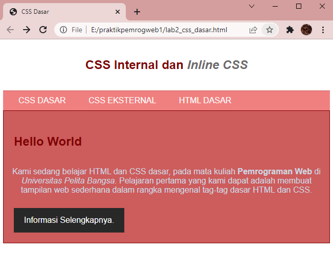

# Web2Lab2

**Nama    : Aning Kinanti** <br>
**NIM     : 312010364** <br>
**Kelas   : TI.20.A2** <br>
**Matkul  : Pemrograman Web** <br>

## Belajar CSS Dasar

### 1. Membuat dokumen HTML
Buatlah dokumen HTML seperti contoh dibawah ini :
```
    <!DOCTYPE html>
    <html lang="en">
    <head>
        <meta charset="UTF-8">
        <meta http-equiv="X-UA-Compatible" content="IE=edge">
        <meta name="viewport" content="width=device-width, initial-scale=1.0">
        <title>CSS Dasar</title>
    </head>
    <body>
        <header>
            <h1>CSS Internal dan <i>Inline CSS</i></h1>
        </header>
        <nav>
            <a href="lab2_css_dasar.html">CSS DASAR</a>
            <a href="lab2_css_eksternal.html">CSS EKSTERNAL</a>
            <a href="lab1_tag_dasar.html">HTML DASAR</a>
        </nav>

        <!-- CSS ID SELECTOR -->
        <div id="intro">
            <h1>Hello World</h1>
            <p> Kami sedang belajar HTML dan CSS dasar, pada mata kuliah <b>Pemrograman 
                Web</b> di <i>Universitas Pelita Bangsa</i>. Pelajaran pertama yang kami dapat 
                adalah membuat tampilan web sederhana dalam rangka mengenal tag-tag dasar HTML 
                dan CSS.</p>

            <!-- CSS CLASS SELECTOR -->
            <a href="#intro" class="button btn-primary">Informasi Selengkapnya.</a>

        </div>
    </body>
    </html>
```
<br>

Ini adalah hasil dari sintaks diatas :
 <br>

### 2. Mendeklarasikan CSS Internal
Penulisan Internal CSS menggunakan tag `<style>` yang diletakkan pada `<head>` dokumen. <br>
CSS selector berupa elemen selector berlaku pada semua elemen tersebut. <br>
Elemen selector dideklarasikan berdasarkan tag HTML seperti :
```
body {color:blue;}
p {font-family:"sans-serif"}
h1 {text-align:center;color:red';}
```
<br>

Selanjutnya tambahkan deklarasi CSS Internal pada bagian head seperti contoh dibawah ini :
```
    <head>
    <meta charset="UTF-8">
    <meta http-equiv="X-UA-Compatible" content="IE=edge">
    <meta name="viewport" content="width=device-width, initial-scale=1.0">
    <title>CSS Dasar</title>
    <!-- menyisipkan link -->
    <link rel="stylesheet" href="style_eksternal.css" type="text/css">
    <style>
        body {
            font-family:'Open Sans', sans-serif;
        }
        header {
            min-height: 80px;
            border-bottom: 1px solid #77CCEF;
        }
        h1 {
            font-size: 24px;
            color: #800000;
            text-align: center;
            padding: 20px 10px;
        }
        h1 i {
            color: #6d6a6b;
        }
    </style>
    </head>
```
<br>

Ini adalah hasil dari sintaks diatas :
 <br>

### 3. Menambahkan Inline CSS
Inline CSS dengan menambahkan kode CSS pada tag HTML sebagai atribut dan value. <br>
Penempatan CSS secara inline hanya akan mempengaruhi satu bagian baris kode. <br>
Kemudian tambahkan deklarasi inline CSS pada tag `<p>` seperti berikut.:
```
    <p style="text-align: center; color: #ccd8e4;">
```
<br>

Ini adalah hasil dari sintaks diatas :
 <br>

### 4. Membuat CSS Eksternal
Penulisan Eksternal CSS menggunakan tag `<link>` menggunakan atribut href untuk merujuk 
kepada file css yang diletakkan pada `<head>` dokumen. <br>
Buatlah file baru dengan nama "style_eksternal.css" kemudian buatlah deklarasi CSS seperti berikut. <br>
```
    nav {
    background: #f08080;
    color: #fff;
    padding: 10px;
    }

    nav a {
        color: #fff;
        text-decoration: none;
        padding: 10px 20px;
    }

    nav .active,
    nav a:hover {
        background: #800000;
    }
```
<br>

Lalu tambahkan tag `<link>` pada bagian `<head>` untuk merujuk file CSS yang telah dibuat seperti dibawah ini : <br>
```
    <head>
        <!-- menyisipkan link -->
        <link rel="stylesheet" href="style_eksternal.css" type="text/css">
    </head>

``` 
<br>

Ini adalah hasil perubahan dari sintaks diatas :
 <br>

### 5. Menambahkan CSS Selector
Selanjutnya menambahkan CSS Selector menggunakan ID dan Class Selector. <br>
Class Selector dideklarasikan dengan menambahkan tanda titik (.) sebelum nama class yang akan 
digunakan.<br>
Kemudian pada tag HTML ditambahkan atribut class dengan value nama class tanpa 
menggunakan titik (.). <br>
Satu elemen HTML dapat diberikan lebih dari satu class. <br>
Sedangkan ID Selector dideklarasikan dengan menambahkan tanda # sebelum nama id yang akan digunakan. <br>
Kemudian pada tag HTML ditambahkan atribut id dengan value nama id tanpa menggunakan #. <br>
Satu elemen HTML hanya dapat diberikan satu id. <br>
Pada file "style_eksternal.css", tambahkan kode berikut : <br>
```
    /* ID SELECTOR */
    #intro {
        background: #cd5c5c;
        border: 1px solid #800000;
        min-height: 100px;
        padding: 10px;
    }

    #intro h1 {
        text-align: left;
        border: 0;
        color: #800000;
    }

    /* CLASS SELECTOR */
    .button {
        padding: 15px 20px;
        background: #bebcbd;
        color: #fff;
        display: inline-block;
        margin: 10px;
        text-decoration: none;
    }

    .btn-primary {
        background: #282828;
    }
```
<br>

Ini adalah hasil refresh dari sintaks diatas :
 <br>

## SOAL

### Pertanyaan dan Tugas

1. Lakukan eksperimen dengan mengubah dan menambah properti dan nilai pada kode CSS 
dengan mengacu pada CSS Cheat Sheet yang diberikan pada file terpisah dari modul ini. <br>
    Jawab : <br>

2. Apa perbedaan pendeklarasian CSS elemen `h1 {...}` dengan `#intro h1 {...}` ? berikan 
penjelasannya! <br>
    Jawab : Pendeklarasian CSS elemen `h1 {...}` merupakan salah satu dari CSS internal, elemen ini berlaku untuk seluruh tag html `<h1>`, sedangkan `#intro h1 {...}` merupakan bentuk dari ID selector, elemen ini berlaku untuk semua tag html `<h1>` yang hanya terdapat pada tag yang memiliki id intro. <br>

3. Apabila ada deklarasi CSS secara internal, lalu ditambahkan CSS eksternal dan inline CSS pada 
elemen yang sama. Deklarasi manakah yang akan ditampilkan pada browser? Berikan 
penjelasan dan contohnya! <br>
    Jawab : Pertama tambahkan CSS internal `h2  { color: #ff8c00; text-align: right; }` pada tag `<style>` untuk tag `<h2> CSS Internal, Inline CSS, dan CSS Eksternal </h2>`. <br>
    Lalu tambahkan inline CSS pada tag `<h2>` seperti, `<h2 style="text-align:center; color: #20b2aa"> CSS Internal, Inline CSS, dan CSS Eksternal </h2>`. <br>
    Kemudian buat file css baru terlebih dahulu, lalu isi dengan CSS eksternal seperti, `h2 {color: #663399; text-align: left; }`. <br>
    Lalu tambahkan tag `<link>` pada bagian `<head>` untuk merujuk file CSS yang telah dibuat seperti, `<link rel="stylesheet" href="css_eksternal.css" type="text/css">`.  
    maka hasil sintaks keseluruhannya pada file html akan menjadi seperti :
```
    <!DOCTYPE html>
    <html lang="en">
    <head>
        <meta charset="UTF-8">
        <meta http-equiv="X-UA-Compatible" content="IE=edge">
        <meta name="viewport" content="width=device-width, initial-scale=1.0">
        <title>CSS Dasar</title>
        <!-- menyisipkan link -->
        <link rel="stylesheet" href="css_eksternal.css" type="text/css">
        <style>
            body {
                font-family:'Open Sans', sans-serif;
            }
            header {
                min-height: 80px;
                border-bottom: 1px solid #cd5c5c;
            }
            h1 {
                font-size: 24px;
                color: #800000;
                text-align: center;
                padding: 20px 10px;
            }
            h2  {
                color: #ff8c00; 
                text-align: right;
            }
        </style>
    </head>
    <body>
        <header>
            <h2 style="text-align:center; color: #20b2aa"> CSS Internal, Inline CSS, dan CSS Eksternal </h2>
        </header>
    </body>
    </html>
```
<br>

    Setelah dilihat dari hasil nya deklarasi yang dijalankan adalah inline CSS, berikut merupakan hasilnya :    
 <br> 


4. Pada sebuah elemen HTML terdapat ID dan Class, apabila masing-masing selector tersebut 
terdapat deklarasi CSS, maka deklarasi manakah yang akan ditampilkan pada browser? 
Berikan penjelasan dan contohnya! `( <p id="paragraf-1" class="text-paragraf"> )` <br>
    Jawab : Buat file HTML bebas,lalu tambahkan `( <p id="paragraf-1" class="text-paragraf"> )` contohnya seperti dibawah ini : <br>

```
<!DOCTYPE html>
<html lang="en">
<head>
    <meta charset="UTF-8">
    <meta http-equiv="X-UA-Compatible" content="IE=edge">
    <meta name="viewport" content="width=device-width, initial-scale=1.0">
    <title>CSS Dasar</title>
</head>
<body>
    <p class="text-paragraf" id="paragraf-1">Ini adalah paragraf dengan CSS Internal, CSS eksternal, dan Inline CSS</p>
</body>
</html>
```
<br>

Setelah program di run, dapat dilihat deklarasi yang dijalankan yaitu deklarasi ID selector, berikut merupakan hasil outputnya : 
 <br> 


